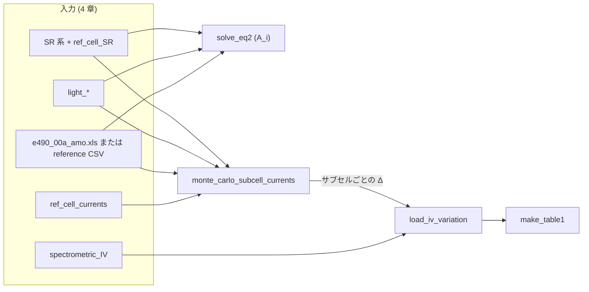
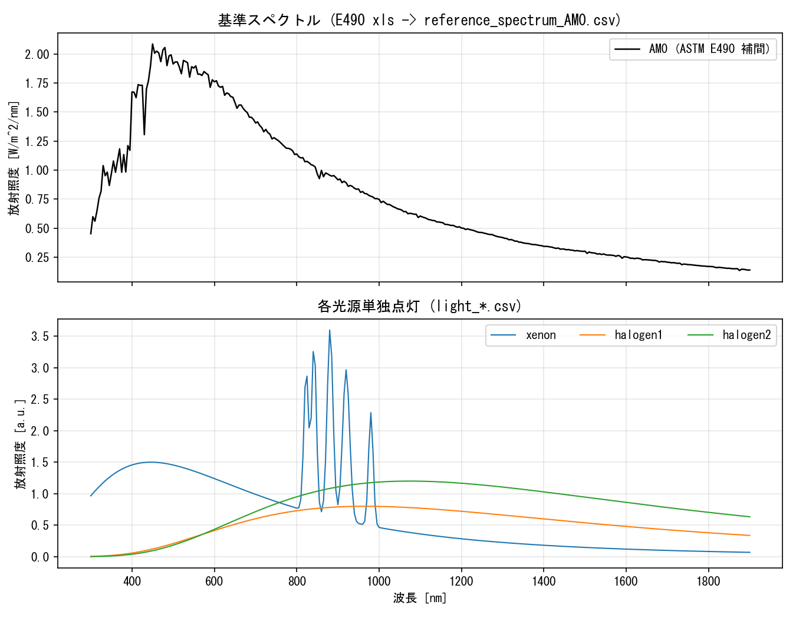
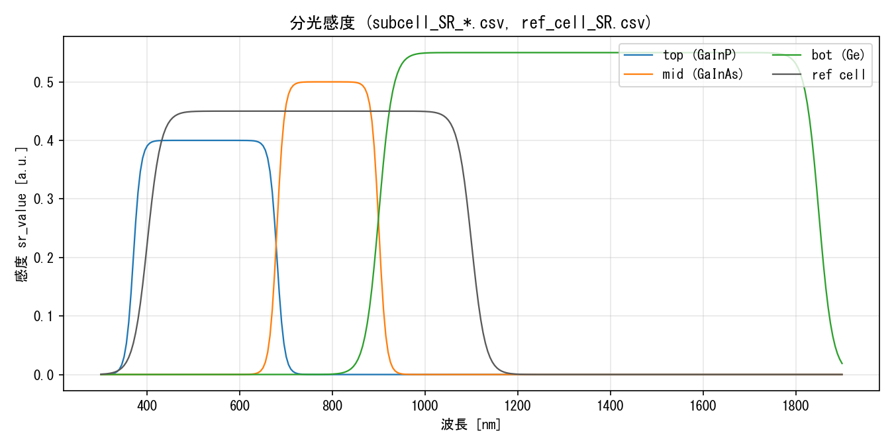
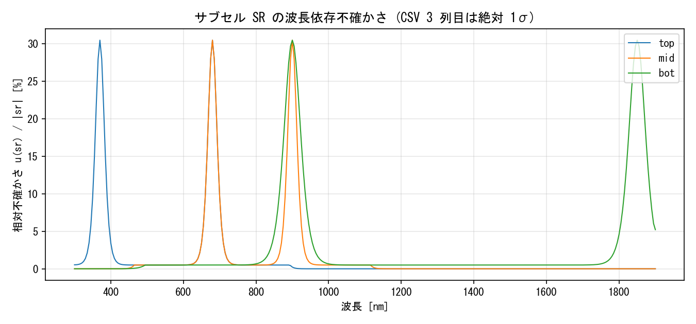
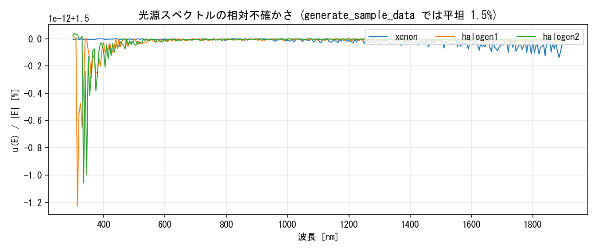
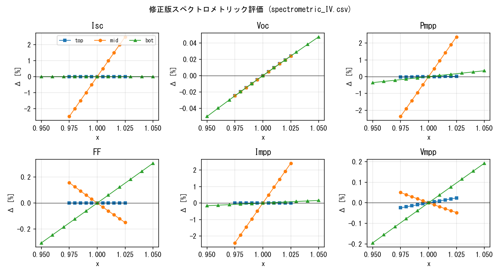
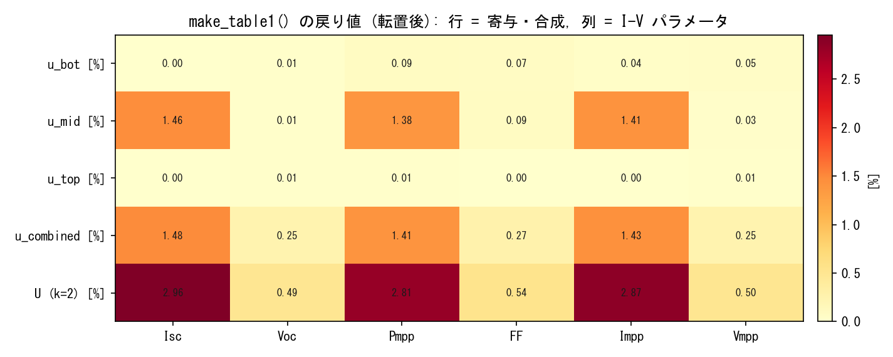

# 多接合太陽電池ソーラシミュレータ不確かさ評価コード

論文 **C. Baur, A.W. Bett, "Measurement Uncertainties of the Calibration of Multi-Junction Solar Cells", 31st IEEE PVSC, 2005** の手法を Python 実装したものです。実測した分光データと修正版スペクトロメトリック評価 I-V データから、ソーラシミュレータ校正の拡張不確かさ U(Y_i) (k=2) を算出します。

---

## 1. インストール

### uv を使う場合 (推奨)

```bash
cd uncertainty_code
uv venv
source .venv/bin/activate
uv pip install -e .
```

### pip を使う場合

```bash
cd uncertainty_code
python3 -m venv .venv
source .venv/bin/activate
pip install -e .
```

依存パッケージは numpy, pandas, matplotlib, tabulate, xlrd (.xls の AM0 表読み込み用) です。

---

## 2. クイックスタート

サンプルデータでエンドツーエンド実行:

```bash
python3 demo_run.py
```

`output/` 配下に以下が生成されます:

- `table1_eq6.csv`, `table1_eq6.md` - 論文 Table 1 形式の最終結果
- `mc_subcell_currents.csv` - モンテカルロによるサブセル光電流不確かさ
- `spectro_curves.png` - 修正版スペクトロメトリック評価カーブ (論文 Fig.4 相当)

README 用の図 (`docs/figures/*.png`) を再生成する場合は、先に `demo_run.py` で `output/table1_eq6.csv` を生成してから次を実行します。

```bash
python demo_run.py
python scripts/plot_readme_figures.py
```

サンプルデータを再生成したい場合:

```bash
python3 sample_data/generate_sample_data.py
```

---

## 3. ディレクトリ構成

```
uncertainty_code/
├── pyproject.toml
├── README.md                            # 本ファイル
├── mj_solar_uncertainty/
│   ├── __init__.py
│   ├── core.py                          # 計算本体 (Eq.2/4/5/6 + Monte Carlo)
│   └── io.py                            # CSV 読み書き
├── scripts/
│   └── plot_readme_figures.py           # README 用サンプル図の再生成
├── sample_data/
│   ├── generate_sample_data.py          # 物理的に妥当な合成データ生成
│   ├── e490_00a_amo.xls                 # ASTM E490 AM0 表 (基準スペクトルのソース)
│   ├── reference_spectrum_AM0.csv       # E490 を 300–1900 nm に補間したキャッシュ
│   ├── ref_cell_SR.csv
│   ├── ref_cell_currents.csv
│   ├── subcell_SR_top.csv / mid / bot
│   ├── light_xenon.csv / halogen1 / halogen2
│   └── spectrometric_IV.csv
├── docs/
│   └── figures/                         # plot_readme_figures.py の出力先
├── demo_run.py
└── output/
```

---

## 4. CSV データフォーマット仕様

実機計測データに差し替える際は、下記フォーマットに整えてください。エンコーディングは UTF-8 (BOM 任意)。

### 4.1 サブセル分光感度 — `subcell_SR_<top|mid|bot>.csv`

| 列名 | 単位 | 説明 |
|---|---|---|
| `wavelength_nm` | nm | 波長 (単調増加) |
| `sr_value` | a.u. または A/W | 相対値で良い (Eq.2 は相対のみ要する) |
| `sr_uncertainty` | sr_value と同単位 | 1σ の絶対不確かさ (波長依存) |

**取得条件**: 25.0 ± 0.5 °C / モノクロ FWHM ≤ 5 nm / バイアス光下 / 波長ステップ 5–10 nm。

### 4.2 基準セル分光感度 — `ref_cell_SR.csv`

サブセル SR と同フォーマット。`sr_value` は相対値で可。

### 4.3 各光源の分光放射照度 — `light_<source_name>.csv`

| 列名 | 単位 | 説明 |
|---|---|---|
| `wavelength_nm` | nm | 波長 |
| `irradiance` | W/m²/nm または a.u. | 各光源単独点灯時の放射照度 |
| `irradiance_uncertainty` | irradiance と同単位 | 1σ |

**取得条件**: 暖機 30 分以上 / 試験セル位置で測定 / 分光放射計は標準ランプでトレーサブル校正。

### 4.4 基準スペクトル — `e490_00a_amo.xls` と `reference_spectrum_AM0.csv`

**推奨ソース (本リポジトリ同梱)**  
`sample_data/e490_00a_amo.xls` は ASTM **E490** の AM0 分光放射照度表です。Excel のシート `NewAM0` を想定し、左端列の波長 **[µm]** と「E-490 **[W/m²/µm]**」列を読み、内部では **W/m²/nm** に換算します (放射照度列を 1000 で除算)。

プログラムからは次のどちらでも読み込めます。

- **`load_astm_e490_am0_xls(path)`** … 表の元解像度のまま `SpectralCurve` を返す (`demo_run.py` はこのファイルが存在するときこちらを使用)。
- **`reference_am0_from_e490_xls_to_grid(xls_path, wavelength_nm)`** … 任意の波長配列へ線形補間 (`generate_sample_data.py` が `reference_spectrum_AM0.csv` を書き出す際に使用)。

`.xls` の全波長範囲を台形積分すると太陽定数に近い **約 1366 W/m²** になります (表の離散化による端数あり)。一方、下記の CSV は **300–1900 nm のみ** を保持するため、その範囲の積分は **約 1200–1300 W/m²** 程度になります (可視〜近赤外の放射フラックスに相当)。

**CSV キャッシュ `reference_spectrum_AM0.csv`**  
他のサンプル CSV と同じ **300–1900 nm、5 nm 刻み** に補間した列だけを保存したものです。`generate_sample_data.py` を実行すると `e490_00a_amo.xls` から再生成されます。`.xls` を置かない環境では、従来どおり簡易プランク+1367 W/m² 正規化の合成スペクトルがフォールバックとして出力されます。

| 列名 | 単位 | 説明 |
|---|---|---|
| `wavelength_nm` | nm | 波長 |
| `irradiance` | W/m²/nm | 基準スペクトル (AM0) |
| `irradiance_uncertainty` | (任意) | 省略可 (省略時は 0 として扱う) |

### 4.5 基準セル光電流 — `ref_cell_currents.csv`

| 列名 | 単位 | 説明 |
|---|---|---|
| `source` | — | 光源名 (light_*.csv のサフィックスと一致) |
| `Jref_A` | A | 各光源単独点灯時の基準セル短絡電流 |
| `Jref_uncertainty_A` | A | 1σ |

### 4.6 修正版スペクトロメトリック評価 I-V — `spectrometric_IV.csv`

論文の手法核心となるデータ。**1 サブセルだけ ±Δ で振り、他は基準 (x=1.0) に固定** した条件で I-V を取得。

| 列名 | 単位 | 説明 |
|---|---|---|
| `subcell` | — | "top" / "mid" / "bot" |
| `x` | — | 対象サブセルの相対光電流 (1.0 が基準条件) |
| `Isc` | A または mA/cm² | 短絡電流 |
| `Voc` | V | 開放電圧 |
| `Pmpp` | W または mW/cm² | 最大電力 |
| `FF` | — | 曲線因子 (0–1) |
| `Impp` | A または mA/cm² | 最大電力点電流 |
| `Vmpp` | V | 最大電力点電圧 |

**取得条件**:
- 25.0 ± 0.5 °C (測定中 ±0.2 °C 維持)
- 各サブセルにつき 11 点程度を ±Δ の範囲で振る (Δ は Step 6 で決まる u(J_phot,j))
- 各 x で 3 回測定し平均
- 各サブセル振り測定の前後で AM0 基準条件 I-V を取り、ドリフト補正

x = 1.0 の行が見つからなければ、最近接行を基準値 Y_i(1) として扱います。

---

## 5. プログラムから使う場合 (API)

```python
from mj_solar_uncertainty import (
    load_spectral, load_reference_spectrum, load_astm_e490_am0_xls,
    load_iv_variation, solve_eq2, monte_carlo_subcell_currents, make_table1,
)

# 1. 計測データ読み込み
sr_top = load_spectral("subcell_SR_top.csv", label="top")
sr_mid = load_spectral("subcell_SR_mid.csv", label="mid")
sr_bot = load_spectral("subcell_SR_bot.csv", label="bot")
sr_ref = load_spectral("ref_cell_SR.csv", label="ref")
sources = [load_spectral(f"light_{n}.csv", label=n)
           for n in ["xenon", "halogen1", "halogen2"]]
# AM0 は ASTM E490 表 (.xls) を直接読むか、補間済み CSV を読む
ref_spec = load_astm_e490_am0_xls("sample_data/e490_00a_amo.xls")
# ref_spec = load_reference_spectrum("sample_data/reference_spectrum_AM0.csv")

# 2. 光源係数 A_i (Eq.2)
A, M, b = solve_eq2([sr_top, sr_mid, sr_bot], sources, ref_spec)

# 3. サブセル光電流不確かさ (Monte Carlo)
import pandas as pd
ref_I = pd.read_csv("ref_cell_currents.csv")
mc = monte_carlo_subcell_currents(
    [sr_top, sr_mid, sr_bot], sources, sr_ref, ref_spec,
    Jref_per_source   = ref_I.Jref_A.values,
    u_Jref_per_source = ref_I.Jref_uncertainty_A.values,
    n_samples=5000, correlation="systematic",
)
delta = {"top": mc.Jphot_subcell_rel[0] / 100.0,
         "mid": mc.Jphot_subcell_rel[1] / 100.0,
         "bot": mc.Jphot_subcell_rel[2] / 100.0}

# 4. Eq.(6) → Table 1
variations = load_iv_variation("spectrometric_IV.csv",
                               delta_relative_per_subcell=delta)
table1 = make_table1(variations,
                     parameters=["Isc","Voc","Pmpp","FF","Impp","Vmpp"],
                     extra_uncertainties_relative={"temperature": 0.10,
                                                   "area": 0.20,
                                                   "electrical": 0.10},
                     coverage_k=2.0)
print(table1)
```

---

## 6. サンプルデータの可視化と `make_table1` の行列表現

CSV の列名と物理量の対応を把握しやすいよう、`sample_data/` をそのままプロットした図を `docs/figures/` に置いています。次のコマンドでいつでも再生成できます。

```bash
python demo_run.py
python scripts/plot_readme_figures.py
```

### 6.1 データが計算パイプラインを通る流れ



### 6.2 スペクトル系 CSV の形状

**基準スペクトルと各光源**（セクション 4.4, 4.3）。上段の AM0 は **ASTM E490** (`e490_00a_amo.xls` を 300–1900 nm に補間した `reference_spectrum_AM0.csv` と同値)。下段のキセノンは可視近傍にスパイク、ハロゲンは黒体に近い平滑な形状です。



**サブセルおよび基準セルの分光感度**（4.1, 4.2）。`generate_sample_data.py` では帯域をずらした台形に近い曲線で近似しています。



**SR の相対不確かさ** \(u(\mathrm{sr}) / |\mathrm{sr}|\)（CSV の 3 列目は絶対 1σ）。合成データではバンドエッジで不確かさが大きくなるようにしてあり、長波長の bot でその傾向が強く出ます（8.3 節とも対応）。



**光源スペクトルの相対不確かさ**。合成では全波長で約 1.5% 一定です（校正系統誤差のイメージ）。



### 6.3 `spectrometric_IV.csv` と Eq.(6)

各サブセルについて **x**（そのサブセルの相対光電流）だけを振り、他サブセルは 1.0 に固定した I-V 系列です。下図は基準点（x = 1.0 の行、なければ中央付近）からの変化率 [%] を重ねたものです。`demo_run.py` が出力する `spectro_curves.png` も同系列を描いています。



`IVVariation.u_Y()` は Eq.(6) に相当し、区間 \([1-\Delta, 1+\Delta]\) 上で \((Y_i(x)-Y_i(1))^2\) を **x について** 台形積分し、その平均の平方根を返します。ここで \(\Delta\) は `load_iv_variation(..., delta_relative_per_subcell=...)` で渡した相対不確かさ（Monte Carlo で得たサブセル光電流の相対値など）です。実データの x の取りうる範囲が \(2\Delta\) より狭い場合は、実際に並んだ x の幅で正規化されます（実装は `core.py` の `IVVariation.u_Y` を参照）。

### 6.4 `make_table1` が返す DataFrame の行と列

内部では **行 = I-V パラメータ**（`Isc`, `Voc`, …）、**列 = 各サブセル由来の相対寄与 [%]** と合成列で組み立てたあと、**転置 (`df.T`)** して返します。その結果:

- **行インデックス**: `u_top [%]`, `u_mid [%]`, `u_bot [%]`（各サブセルが律速したときの Eq.(6) 寄与）、`u_combined [%]`（それらと `extra_uncertainties_relative` の RSS）、`U (k=2) [%]`（`coverage_k` 倍した拡張不確かさ）
- **列**: 指定した `parameters`（例: `Isc`, `Voc`, `Pmpp`, …）

`save_table1_csv` で保存した例（`demo_run.py` 実行後の `output/table1_eq6.csv`）をヒートマップにすると、上記の行列構造が一目で分かります。



実装では、パラメータごとにサブセル寄与を二乗和しルートを取った値が `u_combined [%]` の行に入ります。

```362:386:mj_solar_uncertainty/core.py
def make_table1(
    variations: Dict[str, IVVariation],
    parameters: List[str],
    extra_uncertainties_relative: Optional[Dict[str, float]] = None,
    coverage_k: float = 2.0,
) -> "pd.DataFrame":
    """論文 Table 1 形式の DataFrame を返す."""
    import pandas as pd
    subcell_names = list(variations.keys())
    df = pd.DataFrame(
        index=parameters,
        columns=[f"u_{n} [%]" for n in subcell_names]
                + ["u_combined [%]", "U (k=2) [%]"],
    )
    for p in parameters:
        rels = [variations[n].u_Y_relative(p) for n in subcell_names]
        for n, r in zip(subcell_names, rels):
            df.loc[p, f"u_{n} [%]"] = round(r, 3)
        sum_sq = sum(r ** 2 for r in rels)
        if extra_uncertainties_relative:
            sum_sq += sum(v ** 2 for v in extra_uncertainties_relative.values())
        u_combined = np.sqrt(sum_sq)
        df.loc[p, "u_combined [%]"] = round(u_combined, 3)
        df.loc[p, "U (k=2) [%]"] = round(coverage_k * u_combined, 3)
    return df.T  # 行: 寄与, 列: パラメータ
```

---

## 7. アルゴリズム対応表

| 論文 | 関数 | 場所 |
|---|---|---|
| Eq.(2) 光源係数 A_i 連立方程式 | `solve_eq2` | `core.py` |
| Eq.(3) 光源調整 (基準セル経由) | (Monte Carlo 内に内包) | `core.py` |
| Eq.(4) u(J) 保守的見積もり | `u_J_eq4` | `core.py` |
| Eq.(4) GUM 流独立和 (比較用) | `u_J_independent` | `core.py` |
| Eq.(5) u(A_i) 解析的伝播 | `u_Ai_analytical` | `core.py` |
| 全段一括 Monte Carlo | `monte_carlo_subcell_currents` | `core.py` |
| Eq.(6) u(Y_i) | `IVVariation.u_Y` | `core.py` |
| 表 1 整形 | `make_table1` | `core.py` |

---

## 8. 重要な注意点

### 8.1 Eq.(4) は保守的見積もり

論文 Eq.(4) は波長間の不確かさが完全に正に相関する仮定での上限値です。実際は系統成分(校正)と独立成分(雑音)が混在するため、`monte_carlo_subcell_currents()` を `correlation="systematic"` と `"independent"` の両方で実行し、上下限を把握することを推奨します。実機の不確かさはこの間にあります。

### 8.2 セル種別ごと・基準スペクトルごとに再評価

論文末尾の指摘通り、3J GaInP/GaInAs/Ge と CIGS、AM0 と AM1.5G では結果が大きく異なります。セルや基準条件を変えるたびに再実行してください。

### 8.3 ボトムセル長波長域

Ge サブセル域 (1500 nm 以上) は分光放射計・SR 装置ともに不確かさが大きく、結果を律速します。サンプルデータでも `subcell_SR_bot.csv` の長波長側で u(s(λ)) が大きくなっています。

### 8.4 サンプルデータは合成 (AM0 除く)

`sample_data/` の SR・光源・I-V などは物理的に妥当な**合成**データであり、特定の装置の実測値ではありません。一方、**基準スペクトル AM0 は同梱の ASTM E490 表 (`e490_00a_amo.xls`) に基づく**値です (コードの動作確認用の表ファイルであり、計算パイプラインへの接続例として利用)。論文 Table 1 と同オーダーの `U(Pmpp)` が得られるかは入力全体に依存し、E490 採用後は数値が変わります。

---

## 9. 参考文献

1. C. Baur, A.W. Bett, "Measurement Uncertainties of the Calibration of Multi-Junction Solar Cells", 31st IEEE PVSC, 2005, pp. 583–586.
2. M. Meusel, R. Adelhelm, F. Dimroth et al., "Spectral Mismatch Correction and Spectrometric Characterization of Monolithic III-V Multi-Junction Solar Cells", Prog. Photovolt., 10, 2002, pp. 243–255.
3. ASTM E490, "Standard Solar Constant and Zero Air Mass Solar Spectral Irradiance Tables".
4. ISO/DIS 15387, "Space Systems – Single-Junction Space Solar Cells – Measurement and Calibration Procedures".
5. ISO, "Guide to the Expression of Uncertainty in Measurement (GUM)", 1995.

---

## ライセンス・免責

本コードは校正手順の実装例として提供するものです。実際の認証用途で用いる際は、自所装置の不確かさ要因を網羅的に再評価し、適切な妥当性確認を行ってください。
