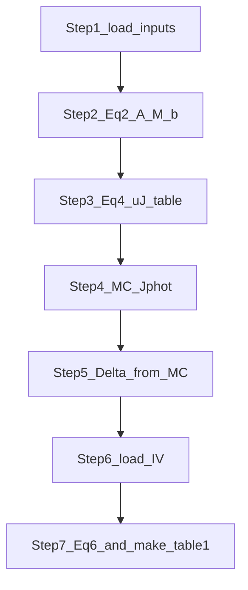
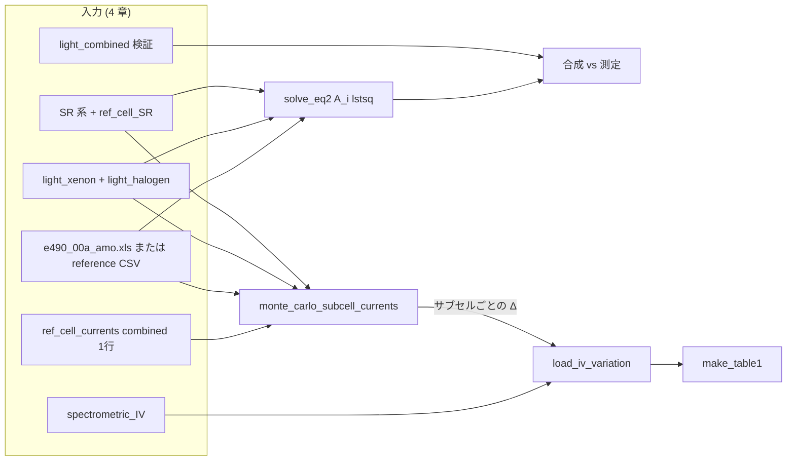

# 多接合太陽電池ソーラシミュレータ不確かさ評価コード

論文 **C. Baur, A.W. Bett, "Measurement Uncertainties of the Calibration of Multi-Junction Solar Cells", 31st IEEE PVSC, 2005** の手法を Python 実装したものです。実測した分光データと修正版スペクトロメトリック評価 I-V データから、ソーラシミュレータ校正の拡張不確かさ U(Y_i) (k=2) を算出します。

本ドキュメントでいう **「不確かさ」** は、測定値やモデル出力が真の値からどれだけばらつきうるかを **標準偏差 (1σ)** や **拡張不確かさ (k=2 でおおよそ 95% 信頼に相当)** で表したものです（日常語の「確からしさ」の度合いとセットで理解するとよいですが、コード上の用語は GUM に沿い **uncertainty = 不確かさ** とします）。

---

## はじめに（初めて読む方向け）

### そもそも「ソーラシミュレータ校正」とは何か

宇宙用の多接合太陽電池は、地上の **ソーラシミュレータ**（キセノンランプやハロゲンランプなどを組み合わせた人工太陽光）の下で性能評価されます。人工光は本物の太陽光（ここでは **AM0** などの基準スペクトル）と波長ごとのエネルギー配分が完全には一致しません。**校正**とは、「このシミュレータの設定で、試験セル位置のスペクトルを基準条件にどれだけ近づけるか」を数理的に決める作業です。

多接合セルは **上・中・下** のサブセルがそれぞれ違う波長帯を担当します。たとえば三接合なら、短波長側を top、中間を mid、長波長を bot とみなし、**各サブセルが目標スペクトル下でどれだけ光電流を得られるか**がそろうように、複数光源の強さ係数（本コードでは **A_i**）を決めます。これが論文の **Eq.(2)** に相当する連立方程式のイメージです。

### このリポジトリが「やっていること」一言で

**「分光データ（セル感度・各ランプ・基準太陽スペクトル）と、サブセル光電流をわずかに変えたときの I-V 曲線の実験結果」から、校正後のセル特性（Isc, Voc, Pmpp など）の相対不確かさ [%] を、論文の手順に沿って計算する**ためのコードです。サンプル CSV でそのまま試せます。

### 用語のミニ辞典

| 用語 | ひとことで |
|------|------------|
| **AM0** | 大気外の太陽スペクトル。本リポジトリでは ASTM E490 表をソースにできます。 |
| **SR（分光感度）** | 波長ごとに「その光でどれだけ電流が出やすいか」の形。相対値でも Eq.(2) は成り立ちます。 |
| **`sr_uncertainty`** | CSV に入れる **s(λ) そのものの標準不確かさ（1σ）**。分光計のカタログ値だけではなく、**その太陽電池試料と測定手順に紐づく**不確かさの合成として与える想定です（§4.1.1）。 |
| **放射照度スペクトル** | 波長ごとの光の強さ。Eq.(2) では **テンプレート** `light_xenon.csv` / `light_halogen.csv` を用い、両灯同時測定があれば `light_combined.csv` で合成との整合を検証します。 |
| **Eq.(2) の A_i** | ランプをどの比率で混ぜれば、各サブセルの目標積分（AM0 との整合）に近づくかの係数。 |
| **u(J), Eq.(4)** | スペクトル積分値の不確かさの **保守的な上限**のイメージ（波長間相関を単純化）。 |
| **Monte Carlo (MC)** | スペクトルを測定誤差の範囲でランダムに振り、何千回も Eq.(2) を解き直して **ばらつき** を見る手法。 |
| **Δ（デルタ）** | サブセル光電流の相対不確かさ。Eq.(6) で「x をどの幅で振って I-V 曲線の変化を積分するか」に使います。 |
| **修正版スペクトロメトリック I-V** | あるサブセルだけ光電流比 x を変え、他は 1.0 に固定した I-V の系列。論文の手順の中心データです。 |
| **Eq.(6) の u(Y)** | 上記の曲線が x=1 付近でどれだけ急に変化するかから、特性 Y（例: Pmpp）の標準不確かさを見積もる式。 |
| **RSS 合成** | 独立とみなせる複数の要因の不確かさを、二乗和の平方根でまとめる方法（`u_combined`）。 |
| **U (k=2)** | 報告用の **拡張不確かさ**。ここでは `U ≈ 2 × u_combined`（正規分布近似でおよそ 95% 区間の半幅）。 |

### モンテカルロ法を使う理由

本コードでは、Eq.(4) に相当する **波長ごとの積分不確かさの解析的上限**に加え、**モンテカルロ (MC)** でスペクトルを繰り返し摂動して **`monte_carlo_subcell_currents`** からサブセル光電流のばらつき（Step 4 → **Δ**）を求めます。MC を併用する主な理由は次のとおりです。

1. **複数スペクトルが絡む非線形な計算連鎖**  
   各試行で「SR・光源テンプレート・基準スペクトル（および必要なら J_ref）」を少し変え、台形積分で **M** と **b** を組み立て直し、Eq.(2) を **`solve` または `lstsq`** で解き直します。**入力の小さな変化が A や積分値にどう伝わるか**を、偏微分の連鎖で一括して書き下ろすのは現実的でない場合が多く、MC は **同じ手順をそのまま何千回も回す**ことで、結果分布（標準偏差など）を直接得られます。

2. **Eq.(4) との役割分担**  
   Eq.(4) は波長間相関を単純化した **保守的な上界**として有用ですが、仮定が強いぶん **実データに近いばらつき**とはずれることがあります。MC は **与えた u(λ) の摂動モデル**のもとでの数値実験であり、Eq.(4) と **比較・検証**するための別経路として位置づけられます（§8.1）。

3. **系統的相関と独立雑音の切り替え**  
   `correlation="systematic"` と `"independent"` は、波長ごとの誤差を **同じ向きに動かす**か **独立に振る**かの違いです。相関構造を簡潔な式で全域積分に埋め込むより、**乱数の与え方を変える**方が実装と解釈が直感的です。

4. **後段 Eq.(6) に渡す Δ の現実的な大きさ**  
   校正不確かさの Table 1 では、サブセル光電流の相対不確かさ **Δ** の幅が必要です。MC で得た相対ばらつきを **Step 5 で Δ に読み替え**、スペクトロメトリック I-V に接続する流れは、論文手順に沿った **数値的なつなぎ**として採用されています。

乱数を使うため **試行回数とシード**に依存します。重要な結論では `n_mc_samples` を十分大きくし、必要なら複数シードで安定性を確認してください。

### 料理にたとえた「データの流れ」（例）

1. **材料をそろえる（Step 1）**  
   各サブセルの SR、**2 本の光源テンプレート**、両灯同時の測定スペクトル（任意だがサンプルでは同梱）、AM0 表、基準セルの短絡電流（同時点灯 1 値）などを CSV から読みます。＝レシピの材料確認。

2. **混ぜ合わせ比率を決める（Step 2, Eq.(2)）**  
   「top / mid / bot の目標積分（AM0 との整合）」に対し、テンプレート **e₁, e₂** の重み **A₁, A₂** を **最小二乗**（サブセル数 3、光源 2 のとき）で求めます。厳密に **M A = b** とは限らず残差が出ます（`step02_*.csv` と `max_abs_residual_MA_minus_b`）。合成測定 `light_combined.csv` との比較は `step02b_combined_residual_check.csv` に保存されます。

3. **材料のばらつきで味がどれだけブレるか（Step 3–4）**  
   SR やスペクトルの **測定誤差列** を使い、積分や光電流が何 % ぶれるかを Eq.(4) や MC で見ます。＝`step03_*.csv` と `mc_subcell_currents.csv`。

4. **「少し濃い／薄い」で出来上がりがどう変わるか試食（Step 6–7, Eq.(6)）**  
   あるサブセルの光電流だけを x=0.97〜1.03 のように振った I-V 実験（`spectrometric_IV.csv`）から、Pmpp などがどれだけ敏感かを読み取り、Step 4 で得た **Δ** の幅で式 (6) を積分します。

5. **最後に皿に盛る（Table 1）**  
   top / mid / bot 由来のぶれを RSS で足し、温度・面積などの追加要因も入れて **`u_combined`**、報告用に **`U (k=2)`** を出します。

### 数の例で `table1_eq6.csv` を読む

`demo_run.py` を実行すると `output/table1_eq6.csv` ができます。**列**が I-V パラメータ、**行**が寄与の内訳です（`make_table1` は表示のため行列を転置しています）。

例として、サンプルパイプラインの典型値に近い読み方をします（実数は実行ごとにわずかに変わります）。

- **`u_mid [%]` の `Pmpp` が 1.383**  
  「mid サブセルだけ光電流が不確かだと仮定したとき、Eq.(6) から推定される最大電力の相対ぶれが約 1.38%」という意味です。

- **`u_combined [%]` の `Pmpp` が 1.407**  
  top / mid / bot の寄与（0, 1.383, 0.087 のような値）と、温度・面積・電気の追加（0.1, 0.2, 0.1%）を **二乗して足して平方根**した合成値です。たとえば寄与が 1.5% と 2.0% だけなら √(1.5² + 2.0²) ≈ 2.5% のように、**大きい方が支配的になりにくい**のが RSS の特徴です。

- **`U (k=2) [%]` の `Pmpp` が 2.814**  
  おおよそ「報告で使う拡張不確かさ」で、ここでは **約 2 × u_combined** です。Pmpp の校正結果を「±2.8% 程度の幅で説明できる」と読むイメージです（厳密な信頼水準は測定モデル次第です）。

### フォルダとファイルの役割

| 場所 | 役割 |
|------|------|
| [`mj_solar_uncertainty/core.py`](mj_solar_uncertainty/core.py) | 式そのもの（Eq.(2)(4)(6)、MC、`make_table1` など）。 |
| [`mj_solar_uncertainty/pipeline.py`](mj_solar_uncertainty/pipeline.py) | 上記を **Step 1〜7** に分けて実行し、中間 CSV を `output/` に残すオーケストレーション。 |
| [`mj_solar_uncertainty/io.py`](mj_solar_uncertainty/io.py) | CSV / E490 xls の読み込みと Table の保存。 |
| [`demo_run.py`](demo_run.py) | サンプルで一発実行するエントリ。内部ではパイプラインを呼ぶだけ。 |
| [`sample_data/`](sample_data/) | 動作確認用の合成データと E490 表。実験データに差し替えれば本番評価に使えます。 |
| [`sample_data/generate_sample_data.py`](sample_data/generate_sample_data.py) | サンプル CSV を再生成するスクリプト。 |
| [`output/`](output/) | 計算結果（Table 1、各 Step の CSV、図など）。**ここをレポートの根拠資料**として使えます。 |
| [`scripts/plot_readme_figures.py`](scripts/plot_readme_figures.py) | README 用の図を `docs/figures/` に書き出す補助スクリプト。 |
| [`tests/test_pipeline.py`](tests/test_pipeline.py) | パイプラインの自動検証。 |

### よくある質問（超要約）

- **Q. AM0 と AM1.5G はどう違う？**  
  **A.** 大気外 (AM0) と地上の晴天日射 (AM1.5G) でスペクトル形状が違います。宇宙用セルなら AM0 が標準的な比較の「正解スペクトル」です。条件を変えたら **同じ手順でも数値は変わる**ので、使う基準スペクトルに合わせてデータを用意してください。

- **Q. 光源が 2 本なのにサブセルは 3 つでよいの？**  
  **A.** はい。**テンプレート光源本数**を **サブセル数以下**（ここでは 2≤3）に置き、**M A ≈ b** を [`numpy.linalg.lstsq`](https://numpy.org/doc/stable/reference/generated/numpy.lstsq.html) で解きます（実装は [`solve_eq2`](mj_solar_uncertainty/core.py)）。光源本数がサブセル数と等しければ従来どおり `solve` で厳密解です。両灯同時の測定スペクトルは Eq.(2) の右辺には使わず、**A₁e₁+A₂e₂** との差で報告・検証用に使います。

- **Q. `step04_mc_perturb_breakdown_*.csv` の列がほとんど動かないように見える**  
  **A.** 現行のサブセル光電流統計は主に **摂動したサブセル SR と E_ref の積分**から来るため、光源スペクトルだけを振った行は **この指標には現れにくい**場合があります。全体の同時摂動 (`perturb=all`) と系統/独立の比較を主に参照してください（§8.5 も参照）。

### この README の読み方

- **背景と直感** … 本節「はじめに」まで（**Monte Carlo を併用する理由**も本節）。  
- **CSV の列の意味** … §4（**SR の不確かさの考え方は §4.1.1**）。  
- **API で自分のデータを回す** … §5。  
- **図で把握する** … §6 と [`docs/figures/`](docs/figures/)。

---

## 1. インストール

### uv を使う場合 (推奨)

```bash
cd uncertainty_code
uv venv
source .venv/bin/activate
uv pip install -e .
```

### pip を使う場合

```bash
cd uncertainty_code
python3 -m venv .venv
source .venv/bin/activate
pip install -e .
```

依存パッケージは numpy, pandas, matplotlib, tabulate, xlrd (.xls の AM0 表読み込み用) です。

以下の `cd uncertainty_code` は **クローン先のフォルダ名に読み替えて**ください（本リポジトリ名がそのままでも構いません）。

---

## 2. クイックスタート

サンプルデータでエンドツーエンド実行:

```bash
python3 demo_run.py
```

`output/` 配下に以下が生成されます:

- `table1_eq6.csv`, `table1_eq6.md` - 論文 Table 1 形式の最終結果
- `mc_subcell_currents.csv` - モンテカルロによるサブセル光電流不確かさ
- `step02_A.csv`, `step02_M.csv`, `step02_b.csv` - Eq.(2) の係数と右辺（2 光源時は A が 2 行）
- `step02b_combined_residual_check.csv` - 合成測定とテンプレート合成の波長別差（検証用）
- `step03_uJ_eq4_relative_pct.csv` - Eq.(4) による u(J) 相対 [%]
- `step04_mc_perturb_breakdown_systematic.csv` / `..._independent.csv` - MC の `perturb` 別参考値
- `step07_eq6_contributions_pct.csv` - Eq.(6) サブセル別寄与 [%]
- `step07_extras_squared.csv` - 温度・面積・電気など追加要因の二乗
- `pipeline_summary.md` - Step と成果物の対応表
- `spectro_curves.png` - 修正版スペクトロメトリック評価カーブ (論文 Fig.4 相当)

### Step パイプライン (実装概要)

計算は [`mj_solar_uncertainty/pipeline.py`](mj_solar_uncertainty/pipeline.py) の `run_uncertainty_pipeline()` に集約され、**Step 1 (入力)** から **Step 7 (Eq.(6) + RSS で Table 1)** まで中間表を順に生成します。



プログラムからのみ実行する例:

```python
from mj_solar_uncertainty import run_uncertainty_pipeline

run_uncertainty_pipeline("sample_data", "output", n_mc_samples=3000, mc_seed=42)
```

**MC の `perturb` 分解について:** `monte_carlo_subcell_currents(..., perturb="subcell_sr"|"lights"|...)` は、指定カテゴリだけを摂動したときの参考用です。各成分の二乗和の平方根は **入力間相関を無視した感度分解**であり、`perturb="all"` の同時摂動と一般には一致しません。また現行の `J_phot,j` 統計は主に **摂動後サブセル SR と E_ref の積分**に依存するため、`lights` / `ref_sr` / `Jref` だけを振っても **この量にほとんど現れない**場合があります (実装コメント参照)。解釈は補助情報として用いてください。

README 用の図 (`docs/figures/*.png`) を再生成する場合は、先に `demo_run.py` で `output/table1_eq6.csv` を生成してから次を実行します。

```bash
python demo_run.py
python scripts/plot_readme_figures.py
```

サンプルデータを再生成したい場合:

```bash
python3 sample_data/generate_sample_data.py
```

---

## 3. ディレクトリ構成

```
uncertainty_code/
├── pyproject.toml
├── README.md                            # 本ファイル
├── mj_solar_uncertainty/
│   ├── __init__.py
│   ├── core.py                          # 計算本体 (Eq.2/4/5/6 + Monte Carlo)
│   ├── pipeline.py                      # Step 分割パイプライン
│   └── io.py                            # CSV 読み書き
├── tests/
│   └── test_pipeline.py                 # パイプラインの unittest
├── scripts/
│   └── plot_readme_figures.py           # README 用サンプル図の再生成
├── sample_data/
│   ├── generate_sample_data.py          # 物理的に妥当な合成データ生成
│   ├── e490_00a_amo.xls                 # ASTM E490 AM0 表 (基準スペクトルのソース)
│   ├── reference_spectrum_AM0.csv       # E490 を 300–1900 nm に補間したキャッシュ
│   ├── ref_cell_SR.csv
│   ├── ref_cell_currents.csv
│   ├── subcell_SR_top.csv / mid / bot
│   ├── light_xenon.csv, light_halogen.csv   # Eq.(2) 用テンプレート
│   ├── light_combined.csv                   # 両灯同時測定（検証・報告用）
│   └── spectrometric_IV.csv
├── docs/
│   └── figures/                         # plot_readme_figures.py の出力先
├── demo_run.py
└── output/
```

---

## 4. CSV データフォーマット仕様

実機計測データに差し替える際は、下記フォーマットに整えてください。エンコーディングは UTF-8 (BOM 任意)。

### 4.1 サブセル分光感度 — `subcell_SR_<top|mid|bot>.csv`

| 列名 | 単位 | 説明 |
|---|---|---|
| `wavelength_nm` | nm | 波長 (単調増加) |
| `sr_value` | a.u. または A/W | 相対値で良い (Eq.2 は相対のみ要する) |
| `sr_uncertainty` | sr_value と同単位 | 1σ の絶対不確かさ (波長依存) |

**取得条件**: 25.0 ± 0.5 °C / モノクロ FWHM ≤ 5 nm / バイアス光下 / 波長ステップ 5–10 nm。

#### 4.1.1 `sr_uncertainty` は何を表すか（対象セル視点の GUM）

CSV の **`sr_value` は「ある多接合セルの、あるサブセル（top / mid / bot）について、採用した測定手順のもとで報告された分光感度曲線 s(λ)」**です。列 **`sr_uncertainty` は、その曲線 s(λ) を真の値とみなしたときの標準不確かさ u(s(λ))**（通常は **絶対値・1σ**）を波長ごとに与えます。

ここで重要なのは、**不確かさの主体が「分光計そのもの」だけではない**という点です。測定機の性能は大きな要因ですが、GUM の言い方をすれば、不確かさ評価の対象は **「この試料セルのこのサブセルの分光感度という量」**であり、その見積もりには **試料・多接合構造・測定条件に起因する成分**が本質的に入ります。たとえば次のような要因が、装置要因とあわせて **合成標準不確かさ**（二乗和の平方根など）にまとめられ、最終的に u(s(λ)) として表現される、という整理になります。

- **試験対象（太陽電池）および多接合としての寄与**  
  - **サブセル分離の不完全さ**: バイアス光・フィルタ・電圧条件によって「見えている」接合が理想ほど分離できていないとき、報告曲線は複数接合が混ざった見かけの SR になり、その解釈幅が不確かさに入ります。  
  - **照射位置と空間均一性**: モノクロビームがセル全面を代表していない場合、セル内の不均一性が曲線のばらつきや系統差として現れます。  
  - **温度・バイアス・接続状態のドリフト**: 測定シーケンス中の試料温度や接触が変わると、s(λ) の再現性が落ちます。  
  - **同一試料・同一手順での繰り返し (Type A)**: 同じセルを同条件で複数回スキャンしたときのばらつきは、少なくともランダム成分の下限の目安になります。

- **測定系・データ処理に由来する寄与（いわゆる「装置側」だが、あくまで s(λ) という量の不確かさに換算される）**  
  - 参照検出器・校正チェーンのトレーサブル不確かさ、電流計の校正・非線形性、ショットノイズに相当する散らばり。  
  - **波長軸**（モノクロメータの準位、グレーティングの再現性）と **スペクトル帯域（FWHM）**、および報告波長ステップとの関係（帯域補正をしない場合、帯域が等価的に曲線の幅広がりとして現れる）。  
  - **迷光・リーク光**、特にバンドエッジ付近や長波長域では、見かけの SR が大きく歪み、不確かさ評価でも律速しやすい（§8.3 も参照）。

**本コードでの使われ方**: Eq.(4) の `u_J_eq4` や Monte Carlo では、各波長の **u(s)** と光源スペクトル **e(λ)**（または AM0）を組み合わせて積分し、**「そのセル・そのサブセルの SR 曲線が少し違ったら積分 J はどれだけ動くか」**を評価します。したがって CSV に書く `sr_uncertainty` は、**「校正や不確かさ解析の対象になっているそのセルについて、各 λ での s の信頼幅」**として与えるのが筋です。装置メーカの「波長分解能 ○ nm」のような単独仕様をそのまま一列に貼るのではなく、**自ラボの SR 測定の不確かさ見積もり表（budget）から、s(λ) に割り当てた結果**を波長依存で（または区間ごとに一定で）埋める運用を推奨します。

**波長依存の与え方**: 実務では、(i) 各波長点ごとに budget を伝播させて u(s) を計算する、(ii) 帯域ごとに代表値を置く、(iii) 相関を無視して保守的に大きめの平坦値を置く、などがあります。本リポジトリの `sample_data` は **合成**であり、バンドエッジ付近で u(s) を大きくしたり平坦 1.5% のようにしたりしているのは、**コードが列をどう読むか**を示すデモ用で、特定のセルや装置の認定値ではありません。

### 4.2 基準セル分光感度 — `ref_cell_SR.csv`

サブセル SR と同フォーマット。`sr_value` は相対値で可。**`sr_uncertainty` の考え方は §4.1.1 と同じ**で、「その基準セル試料の SR という量」の標準不確かさとして与えます。

### 4.3 光源テンプレートと同時測定 — `light_xenon.csv`, `light_halogen.csv`, `light_combined.csv`

**テンプレート**（`light_xenon.csv`, `light_halogen.csv`）は Eq.(2) の基底 **eᵢ(λ)** として使います。カタログ形状・過去測定・代表スペクトルなど、運用上合意した **2 本**を用意します（列は下表）。

**`light_combined.csv`** は **キセノンとハロゲンを同時点灯**したときに試験面で測った放射照度です。ランプ別の単独測定が無い運用を想定し、パイプラインでは **M, b の計算には使いません**。Step 2 後に **A₁e₁ + A₂e₂** と波長ごとに比較し、残差を CSV に残します。

| 列名 | 単位 | 説明 |
|---|---|---|
| `wavelength_nm` | nm | 波長 |
| `irradiance` | W/m²/nm または a.u. | 放射照度（テンプレートは形状の基準、combined は同時点灯の実測） |
| `irradiance_uncertainty` | irradiance と同単位 | 1σ |

**取得条件（実測時）**: 暖機 30 分以上 / 試験セル位置で測定 / 分光放射計は標準ランプでトレーサブル校正。テンプレートは単独点灯で測れればよいが、本リポジトリのデモでは合成手順で生成しています。

### 4.4 基準スペクトル — `e490_00a_amo.xls` と `reference_spectrum_AM0.csv`

**推奨ソース (本リポジトリ同梱)**  
`sample_data/e490_00a_amo.xls` は ASTM **E490** の AM0 分光放射照度表です。Excel のシート `NewAM0` を想定し、左端列の波長 **[µm]** と「E-490 **[W/m²/µm]**」列を読み、内部では **W/m²/nm** に換算します (放射照度列を 1000 で除算)。

プログラムからは次のどちらでも読み込めます。

- **`load_astm_e490_am0_xls(path)`** … 表の元解像度のまま `SpectralCurve` を返す (`demo_run.py` はこのファイルが存在するときこちらを使用)。
- **`reference_am0_from_e490_xls_to_grid(xls_path, wavelength_nm)`** … 任意の波長配列へ線形補間 (`generate_sample_data.py` が `reference_spectrum_AM0.csv` を書き出す際に使用)。

`.xls` の全波長範囲を台形積分すると太陽定数に近い **約 1366 W/m²** になります (表の離散化による端数あり)。一方、下記の CSV は **300–1900 nm のみ** を保持するため、その範囲の積分は **約 1200–1300 W/m²** 程度になります (可視〜近赤外の放射フラックスに相当)。

**CSV キャッシュ `reference_spectrum_AM0.csv`**  
他のサンプル CSV と同じ **300–1900 nm、5 nm 刻み** に補間した列だけを保存したものです。`generate_sample_data.py` を実行すると `e490_00a_amo.xls` から再生成されます。`.xls` を置かない環境では、従来どおり簡易プランク+1367 W/m² 正規化の合成スペクトルがフォールバックとして出力されます。

| 列名 | 単位 | 説明 |
|---|---|---|
| `wavelength_nm` | nm | 波長 |
| `irradiance` | W/m²/nm | 基準スペクトル (AM0) |
| `irradiance_uncertainty` | (任意) | 省略可 (省略時は 0 として扱う) |

### 4.5 基準セル光電流 — `ref_cell_currents.csv`

**両灯同時点灯**の短絡電流を **1 行**で渡します（ランプ別の J_ref は扱いません）。

| 列名 | 単位 | 説明 |
|---|---|---|
| `source` | — | 固定で `combined`（同時点灯を表すラベル） |
| `Jref_A` | A | 同時点灯時の基準セル短絡電流 |
| `Jref_uncertainty_A` | A | 1σ |

Monte Carlo ではこの **スカラー J_ref** を 1 成分として摂動します（`monte_carlo_subcell_currents` の `Jref`, `u_Jref`）。

### 4.6 修正版スペクトロメトリック評価 I-V — `spectrometric_IV.csv`

論文の手法核心となるデータ。**1 サブセルだけ ±Δ で振り、他は基準 (x=1.0) に固定** した条件で I-V を取得。

| 列名 | 単位 | 説明 |
|---|---|---|
| `subcell` | — | "top" / "mid" / "bot" |
| `x` | — | 対象サブセルの相対光電流 (1.0 が基準条件) |
| `Isc` | A または mA/cm² | 短絡電流 |
| `Voc` | V | 開放電圧 |
| `Pmpp` | W または mW/cm² | 最大電力 |
| `FF` | — | 曲線因子 (0–1) |
| `Impp` | A または mA/cm² | 最大電力点電流 |
| `Vmpp` | V | 最大電力点電圧 |

**取得条件**:
- 25.0 ± 0.5 °C (測定中 ±0.2 °C 維持)
- 各サブセルにつき 11 点程度を ±Δ の範囲で振る (Δ は Step 6 で決まる u(J_phot,j))
- 各 x で 3 回測定し平均
- 各サブセル振り測定の前後で AM0 基準条件 I-V を取り、ドリフト補正

x = 1.0 の行が見つからなければ、最近接行を基準値 Y_i(1) として扱います。

---

## 5. プログラムから使う場合 (API)

```python
from mj_solar_uncertainty import (
    load_spectral, load_reference_spectrum, load_astm_e490_am0_xls,
    load_iv_variation, solve_eq2, monte_carlo_subcell_currents, make_table1,
)

# 1. 計測データ読み込み
sr_top = load_spectral("subcell_SR_top.csv", label="top")
sr_mid = load_spectral("subcell_SR_mid.csv", label="mid")
sr_bot = load_spectral("subcell_SR_bot.csv", label="bot")
sr_ref = load_spectral("ref_cell_SR.csv", label="ref")
sources = [load_spectral(f"light_{n}.csv", label=n)
           for n in ["xenon", "halogen"]]
# AM0 は ASTM E490 表 (.xls) を直接読むか、補間済み CSV を読む
ref_spec = load_astm_e490_am0_xls("sample_data/e490_00a_amo.xls")
# ref_spec = load_reference_spectrum("sample_data/reference_spectrum_AM0.csv")

# 2. 光源係数 A_i (Eq.2) — 2×3 なら最小二乗
A, M, b = solve_eq2([sr_top, sr_mid, sr_bot], sources, ref_spec)

# 3. サブセル光電流不確かさ (Monte Carlo)
import pandas as pd
ref_I = pd.read_csv("ref_cell_currents.csv")
assert len(ref_I) == 1 and ref_I["source"].iloc[0] == "combined"
mc = monte_carlo_subcell_currents(
    [sr_top, sr_mid, sr_bot], sources, sr_ref, ref_spec,
    Jref=float(ref_I["Jref_A"].iloc[0]),
    u_Jref=float(ref_I["Jref_uncertainty_A"].iloc[0]),
    n_samples=5000, correlation="systematic",
)
delta = {"top": mc.Jphot_subcell_rel[0] / 100.0,
         "mid": mc.Jphot_subcell_rel[1] / 100.0,
         "bot": mc.Jphot_subcell_rel[2] / 100.0}

# 4. Eq.(6) → Table 1
variations = load_iv_variation("spectrometric_IV.csv",
                               delta_relative_per_subcell=delta)
table1 = make_table1(variations,
                     parameters=["Isc","Voc","Pmpp","FF","Impp","Vmpp"],
                     extra_uncertainties_relative={"temperature": 0.10,
                                                   "area": 0.20,
                                                   "electrical": 0.10},
                     coverage_k=2.0)
print(table1)
```

---

## 6. サンプルデータの可視化と `make_table1` の行列表現

CSV の列名と物理量の対応を把握しやすいよう、`sample_data/` をそのままプロットした図を `docs/figures/` に置いています。次のコマンドでいつでも再生成できます。

```bash
python demo_run.py
python scripts/plot_readme_figures.py
```

### 6.1 データが計算パイプラインを通る流れ



### 6.2 スペクトル系 CSV の形状

**基準スペクトルと光源**（§4.4, §4.3）。上段の AM0 は **ASTM E490** (`e490_00a_amo.xls` を 300–1900 nm に補間した `reference_spectrum_AM0.csv` と同値)。下段は **キセノン／ハロゲンのテンプレート**（破線）と **両灯同時測定**（実線）です。


**サブセルおよび基準セルの分光感度**（4.1, 4.2）。`generate_sample_data.py` では帯域をずらした台形に近い曲線で近似しています。


**SR の相対不確かさ** \(u(\mathrm{sr}) / |\mathrm{sr}|\)（CSV の 3 列目は絶対 1σ）。合成データではバンドエッジで不確かさが大きくなるようにしてあり、長波長の bot でその傾向が強く出ます（8.3 節とも対応）。


**光源スペクトルの相対不確かさ**（xenon / halogen テンプレートと combined）。テンプレートは合成データで全波長おおよそ 1.5% 平坦、combined は合成ルールに従った別の相対不確かさになります。


### 6.3 `spectrometric_IV.csv` と Eq.(6)

各サブセルについて **x**（そのサブセルの相対光電流）だけを振り、他サブセルは 1.0 に固定した I-V 系列です。下図は基準点（x = 1.0 の行、なければ中央付近）からの変化率 [%] を重ねたものです。`demo_run.py` が出力する `spectro_curves.png` も同系列を描いています。


`IVVariation.u_Y()` は Eq.(6) に相当し、区間 \([1-\Delta, 1+\Delta]\) 上で \((Y_i(x)-Y_i(1))^2\) を **x について** 台形積分し、その平均の平方根を返します。ここで \(\Delta\) は `load_iv_variation(..., delta_relative_per_subcell=...)` で渡した相対不確かさ（Monte Carlo で得たサブセル光電流の相対値など）です。実データの x の取りうる範囲が \(2\Delta\) より狭い場合は、実際に並んだ x の幅で正規化されます（実装は `core.py` の `IVVariation.u_Y` を参照）。

### 6.4 `make_table1` が返す DataFrame の行と列

内部では **行 = I-V パラメータ**（`Isc`, `Voc`, …）、**列 = 各サブセル由来の相対寄与 [%]** と合成列で組み立てたあと、**転置 (`df.T`)** して返します。その結果:

- **行インデックス**: `u_top [%]`, `u_mid [%]`, `u_bot [%]`（各サブセルが律速したときの Eq.(6) 寄与）、`u_combined [%]`（それらと `extra_uncertainties_relative` の RSS）、`U (k=2) [%]`（`coverage_k` 倍した拡張不確かさ）
- **列**: 指定した `parameters`（例: `Isc`, `Voc`, `Pmpp`, …）

`save_table1_csv` で保存した例（`demo_run.py` 実行後の `output/table1_eq6.csv`）をヒートマップにすると、上記の行列構造が一目で分かります。


実装では、パラメータごとにサブセル寄与を二乗和しルートを取った値が `u_combined [%]` の行に入ります。

```362:386:mj_solar_uncertainty/core.py
def make_table1(
    variations: Dict[str, IVVariation],
    parameters: List[str],
    extra_uncertainties_relative: Optional[Dict[str, float]] = None,
    coverage_k: float = 2.0,
) -> "pd.DataFrame":
    """論文 Table 1 形式の DataFrame を返す."""
    import pandas as pd
    subcell_names = list(variations.keys())
    df = pd.DataFrame(
        index=parameters,
        columns=[f"u_{n} [%]" for n in subcell_names]
                + ["u_combined [%]", "U (k=2) [%]"],
    )
    for p in parameters:
        rels = [variations[n].u_Y_relative(p) for n in subcell_names]
        for n, r in zip(subcell_names, rels):
            df.loc[p, f"u_{n} [%]"] = round(r, 3)
        sum_sq = sum(r ** 2 for r in rels)
        if extra_uncertainties_relative:
            sum_sq += sum(v ** 2 for v in extra_uncertainties_relative.values())
        u_combined = np.sqrt(sum_sq)
        df.loc[p, "u_combined [%]"] = round(u_combined, 3)
        df.loc[p, "U (k=2) [%]"] = round(coverage_k * u_combined, 3)
    return df.T  # 行: 寄与, 列: パラメータ
```

---

## 7. アルゴリズム対応表

| 論文 | 関数 | 場所 |
|---|---|---|
| Eq.(2) 光源係数 A_i（正方なら solve、それ以外は lstsq） | `solve_eq2` | `core.py` |
| Eq.(3) 光源調整 (基準セル経由) | (Monte Carlo 内に内包) | `core.py` |
| Eq.(4) u(J) 保守的見積もり | `u_J_eq4` | `core.py` |
| Eq.(4) GUM 流独立和 (比較用) | `u_J_independent` | `core.py` |
| Eq.(5) u(A_i) 解析的伝播 | `u_Ai_analytical` | `core.py` |
| 全段一括 Monte Carlo | `monte_carlo_subcell_currents` | `core.py` |
| Eq.(6) u(Y_i) | `IVVariation.u_Y` | `core.py` |
| 表 1 整形 | `make_table1` | `core.py` |
| Step 1–7 オーケストレーション | `run_uncertainty_pipeline` | `pipeline.py` |
| Eq.(6) 寄与行列 (RSS 前) | `eq6_contribution_percent_matrix` | `core.py` |

---

## 8. 重要な注意点

### 8.1 Eq.(4) は保守的見積もり

論文 Eq.(4) は波長間の不確かさが完全に正に相関する仮定での上限値です。実際は系統成分(校正)と独立成分(雑音)が混在するため、`monte_carlo_subcell_currents()` を `correlation="systematic"` と `"independent"` の両方で実行し、上下限を把握することを推奨します。実機の不確かさはこの間にあります。**Monte Carlo を併用する動機の整理**は、はじめにの「モンテカルロ法を使う理由」も参照してください。

### 8.2 セル種別ごと・基準スペクトルごとに再評価

論文末尾の指摘通り、3J GaInP/GaInAs/Ge と CIGS、AM0 と AM1.5G では結果が大きく異なります。セルや基準条件を変えるたびに再実行してください。

### 8.3 ボトムセル長波長域

Ge サブセル域 (1500 nm 以上) は、**参照検出器の感度低下・迷光・バイアス光下での分離の難しさ**などが重なり、**報告された s(λ) の u(s)** が大きくなりやすく、結果を律速しがちです。サンプルデータでも `subcell_SR_bot.csv` の長波長側で `sr_uncertainty` を大きくしています。**SR の不確かさを「セル＋手順＋装置」の合成としてどう割り当てるか**の具体例は §4.1.1 を参照してください。

### 8.4 サンプルデータは合成 (AM0 除く)

`sample_data/` の SR・光源・I-V などは物理的に妥当な**合成**データであり、特定の装置の実測値ではありません。一方、**基準スペクトル AM0 は同梱の ASTM E490 表 (`e490_00a_amo.xls`) に基づく**値です (コードの動作確認用の表ファイルであり、計算パイプラインへの接続例として利用)。論文 Table 1 と同オーダーの `U(Pmpp)` が得られるかは入力全体に依存し、E490 採用後は数値が変わります。

### 8.5 Step 4 の MC 感度分解 (参考値)

`step04_mc_perturb_breakdown_*.csv` は、`monte_carlo_subcell_currents` の `perturb` 引数を変えたときの相対不確かさを並べたものです。Eq.(4) の系統/独立と同様、**感度の目安**として用い、認証計算の唯一の根拠としないでください。

### 8.6 Eq.(5) の解析伝播 `u_Ai_analytical`

`M` が **正方**（光源本数 = サブセル数）のときのみ `A = M^{-1} b` を前提に偏微分で **u(A_i)** を求めます。**2 光源 × 3 接合**のような最小二乗構成では呼び出さず、光源係数の不確かさは主に Monte Carlo で扱う想定です。

---

## 9. 参考文献

1. C. Baur, A.W. Bett, "Measurement Uncertainties of the Calibration of Multi-Junction Solar Cells", 31st IEEE PVSC, 2005, pp. 583–586.
2. M. Meusel, R. Adelhelm, F. Dimroth et al., "Spectral Mismatch Correction and Spectrometric Characterization of Monolithic III-V Multi-Junction Solar Cells", Prog. Photovolt., 10, 2002, pp. 243–255.
3. ASTM E490, "Standard Solar Constant and Zero Air Mass Solar Spectral Irradiance Tables".
4. ISO/DIS 15387, "Space Systems – Single-Junction Space Solar Cells – Measurement and Calibration Procedures".
5. ISO, "Guide to the Expression of Uncertainty in Measurement (GUM)", 1995.

---

## ライセンス・免責

本コードは校正手順の実装例として提供するものです。実際の認証用途で用いる際は、自所装置の不確かさ要因を網羅的に再評価し、適切な妥当性確認を行ってください。
